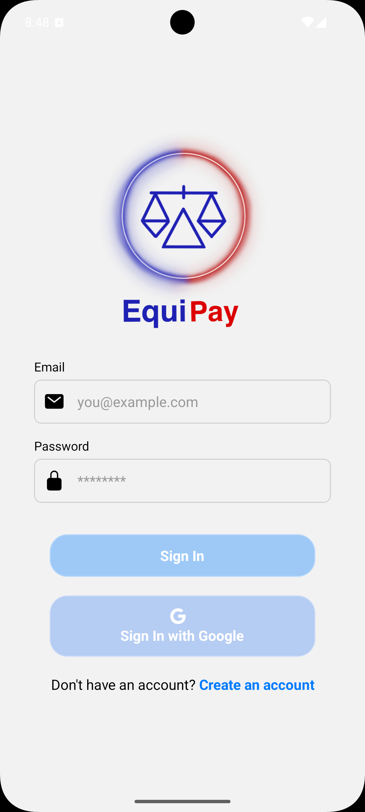
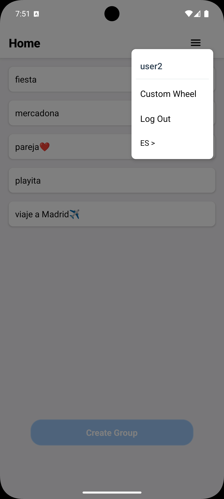
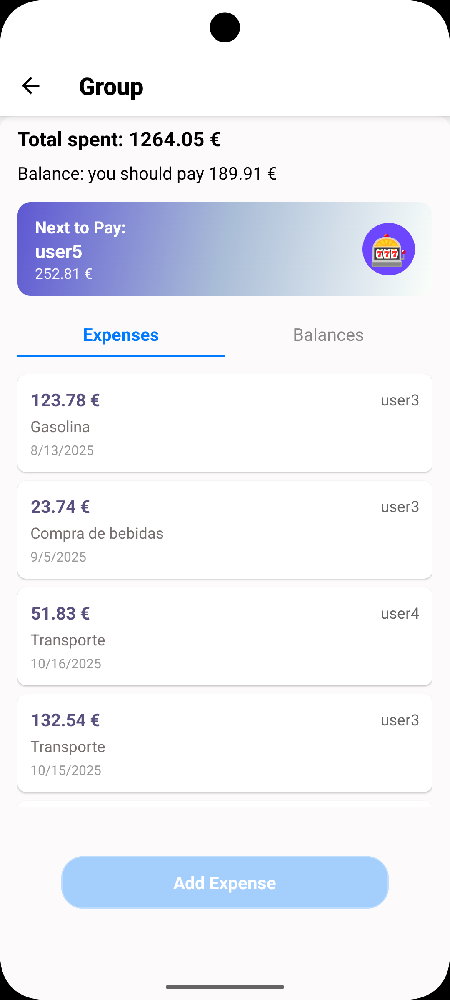
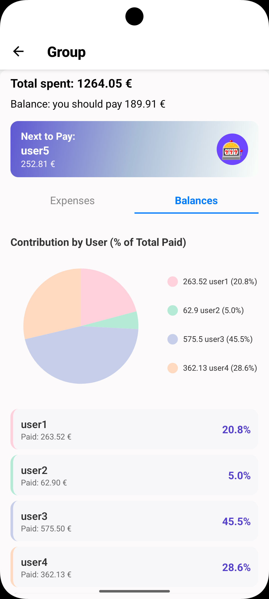
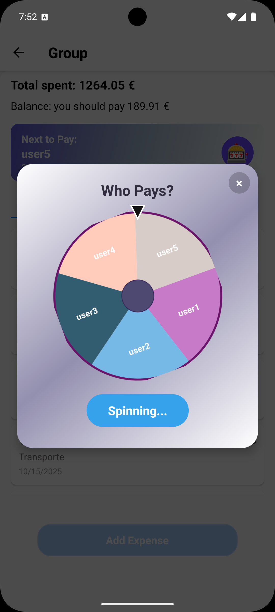

# Equipay

**Equipay** is an app to manage group expenses and split payments fairly and transparently. Perfect for trips, dinners, shared apartments, and any situation where several people share expenses.

## Features

- Create user groups.
- Add expenses.
- View each member's expenses.
- See individual and total balances.
- Contribution charts per user.
- Wheel to randomly choose who pays next.
- Real-time sync with Supabase.
- Intuitive and modern interface.

## Technologies

- **React Native** (Expo)
- **Supabase** (backend and database)
- **TypeScript**
- **react-native-chart-kit** (charts)
- **i18next** (translation)
- **Expo Router**

## Images

## Usage

[Go to Equipay web page](https://equipay-xi.vercel.app/)

1. Sign up
2. Create a group and invite your friends.
3. Add expenses as they happen.
4. The app decides whose turn it is or randomly selects with a wheel.
5. Check the balances.

## License

MIT

---

Piedad P.

----------------------------------------------

# Equipay

**Equipay** es una aplicación para gestionar gastos en grupo y repartir pagos de forma justa y transparente. Ideal para viajes, cenas, pisos compartidos y cualquier situación donde varias personas comparten gastos.

## Características

- Crear grupos de usuarios.
- Añadir gastos.
- Visualizar gastos de cada miembro.
- Ver balances individuales y totales.
- Gráficas de contribución por usuario.
- Ruleta para elegir quién paga la próxima ronda.
- Sincronización en tiempo real con Supabase.
- Interfaz intuitiva y moderna.

## Tecnologías

- **React Native** (Expo)
- **Supabase** (backend y base de datos)
- **TypeScript**
- **react-native-chart-kit** (gráficas)
- **i18next** (traducción)
- **Expo Router**

## Uso

[Ir a la página web de Equipay](https://equipay-xi.vercel.app/)

1. Regístrate
2. Crea un grupo e invita a tus amigos.
3. Añade los gastos conforme vayan ocurriendo.
4. La app decide de quién es el turno o elegir al azar mediante una ruleta.
5. Consulta los balances.

## Licencia

MIT

---

Piedad P.
